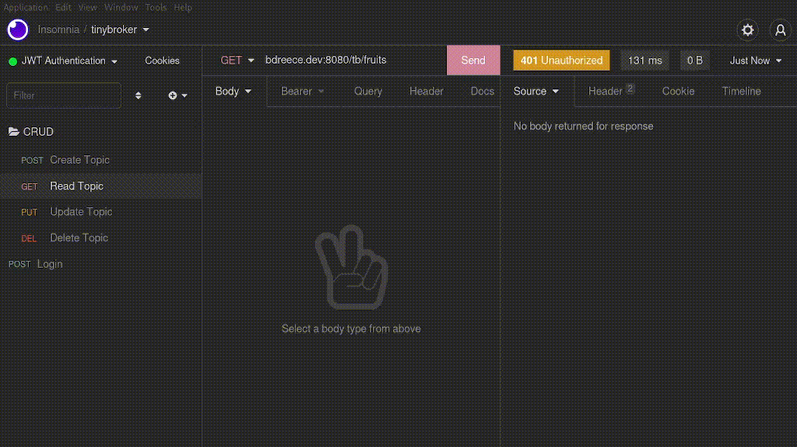

# tinybroker


A simple message broker, written in Go

## Table of Contents

- [Overview](#overview)
- [Getting Started](#getting-started)
  - [Downloading and Installing](#downloading-and-installing)
  - [Running](#running)
- [Usage](#usage)
  - [Client-Side](#client-side)
  - [Insomnia Demo](#insomnia-demo)
- [Future Plans](#future-plans)

---

## Overview

tinybroker is a message broker that implements the pub/sub model, written in Go. Clients can interact with the broker's REST API using standard CRUD conventions on "/{topic}" endpoints. Authentication is performed via JSON web tokens

---

## Getting Started

### Downloading and Installing

Downloading tinybroker is as simple as:

```console
$ go install github.com/bdreece/tinybroker@latest
```

tinybroker is also published to Docker Hub. Pull the tinybroker image via:

```console
$ docker pull bdreece/tinybroker:latest
```

### Running

Once you've installed tinybroker, the executable should be in your `$GOPATH/bin` directory. This can be executed as `tinybroker`, assuming you've configured go correctly. If you've pulled the Docker image, you can spin up a container using the `docker run` command.

---

## Usage

The command-line usage of tinybroker is as follows:

```
usage: tinybroker [-h|--help] [-v|--version] [-V|--verbose <integer>]
                  [-a|--address "<value>"] [-p|--endpoint-prefix "<value>"]
                  [-l|--login-endpoint "<value>"] [-t|--topic-capacity
                  <integer>] [-k|--key-file "<value>"] [-c|--cert-file
                  "<value>"] [-j|--jwt-timeout <integer>] [-w|--write-timeout
                  <integer>] [-r|--read-timeout <integer>]
                  [-s|--shutdown-timeout <integer>]

                  A simple message broker, written in Go

Arguments:

  -h  --help              Print help information
  -v  --version           Display version information and exit. Default: false
  -V  --verbose           Enable verbose output. Default: 0
  -a  --address           Address over which broker is served. Default: :8080
  -p  --endpoint-prefix   Prefix for login and topic endpoints. Default: /tb
  -l  --login-endpoint    API endpoint for JWT authentication. Default: /login
  -t  --topic-capacity    Topic backlog capacity. Default: 32
  -k  --key-file          TLS key file. Default:
  -c  --cert-file         TLS cert file. Default:
  -j  --jwt-timeout       JWT lifetime duration (seconds). Default: 3600
  -w  --write-timeout     HTTP server write timeout (seconds). Default: 5
  -r  --read-timeout      HTTP server read timeout (seconds). Default: 5
  -s  --shutdown-timeout  HTTP server kill signal timeout (seconds). Default: 5
```

Additional parameters (i.e. username, password, JWT HMAC secret) must be passed in as environment variables named `TB_USER`, `TB_PASS`, and `TB_SECRET`, respectively, otherwise a runtime error will occur.

### Client-Side

tinybroker exposes its API over HTTP, utilizing standard CRUD conventions for resource access. For a given endpoint, say `/fruits`, a client may manipulate the 'fruits' topic via the following:

- Create topic 'fruits': `POST /fruits`
- Read from topic 'fruits': `GET /fruits`
- Update topic 'fruits': `PUT /fruits`
- Delete topic 'fruits': `DELETE /fruits`

Furthermore, data may be passed along to the broker using the multipart form content type under the key: `TB_DATA`. Likewise, login information can be passed to the specified authentication endpoint (default: `/login`) using the multipart form with keys `TB_USER` and `TB_PASS`. Note, the `TB_PASS` environment variable should be a hashed string using the SHA-256 hash algorithm.

In order to help illustrate proper broker requests, I've added the following valid `curl` commands for a local tinybroker instance (given the `TB_USER` and `TB_PASS` environment variables have been set to 'user' and 'pass', respectively):

- Request:  `curl -F "TB_USER=user" -F "TB_PASS=$(echo -n 'pass' | openssl dgst -sha256 | cut -d' ' -f2)" localhost:8080/login`
- Response: `<YOUR_JWT_HERE>`
- Request:  `curl --oauth2-bearer "<YOUR_JWT_HERE>" -F "TB_DATA=apple" localhost:8080/fruits`
- Request:  `curl --oauth2-bearer "<YOUR_JWT_HERE>" -F "TB_DATA=orange" localhost:8080/fruits`
- Request:  `curl --oauth2-bearer "<YOUR_JWT_HERE>" localhost:8080/fruits`
- Response: `apple`
- Request:  `curl --oauth2-bearer "<YOUR_JWT_HERE>" localhost:8080/fruits`
- Response: `orange`

### Insomnia Demo



---

## Future Plans

In the future, I would like to add further documentation and mock testing.
